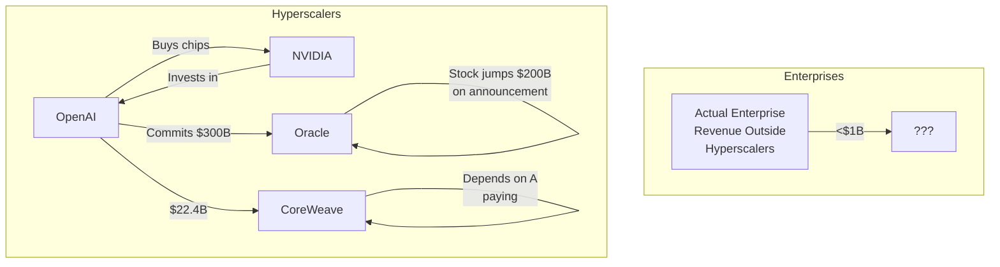
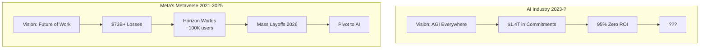

*Or: How to Cut Headcount and Multiply Costs*

---

## The Pitch vs. The Spreadsheet

You've seen the headlines. You've attended the boardroom presentations. Some consultant with expensive slides told you AI will "transform your workforce" and you nodded along while mentally calculating severance packages.

Before you start drafting those redundancy letters, let's talk numbers. Not the shiny projected ones. The real ones.

---

## 95% of AI Projects Return Exactly Nothing

[MIT's 2025 report "The GenAI Divide"](https://campustechnology.com/articles/2025/08/26/mit-report-most-organizations-see-no-business-return-on-gen-ai-investments.aspx) dropped a truth bomb: despite **$30-40 billion** in enterprise AI investment, [**95% of organizations report zero measurable return**](https://www.entrepreneur.com/business-news/most-companies-saw-zero-return-on-ai-investments-study/496144) on their AI pilots.

Not negative return. *Zero.*

The report, based on 150 executive interviews and analysis of 300 AI deployments, found that [most GenAI systems don't retain feedback, adapt to context, or improve over time](https://thehill.com/policy/technology/5460663-generative-ai-zero-returns-businesses-mit-report/). They're expensive parrots with excellent grammar.

> "Most GenAI systems do not retain feedback, adapt to context, or improve over time." - MIT Media Lab, July 2025

Only [5% of companies extracting value](https://thefinancialbrand.com/news/artificial-intelligence-banking/why-95-of-enterprises-are-getting-zero-return-on-ai-investment-191950). And those winners share a common trait: they didn't try to replace humans. They augmented specific, bounded tasks.

---

## The Jobs Are Disappearing... But Why?

[UK entry-level jobs have dropped **32% since ChatGPT launched**](https://bmmagazine.co.uk/news/uk-entry-level-job-losses-ai-chatgpt/) in November 2022. Retail positions alone fell by 78%. [IT entry-level roles down 55%](https://itbrief.co.uk/story/uk-entry-level-tech-jobs-drop-by-32-amid-chatgpt-rise).

Looks damning, right?

Not so fast. Even the [Institute of Student Employers admits it's "too early for AI to impact graduate job numbers."](https://www.hrmagazine.co.uk/content/news/entry-level-jobs-down-since-chatgpt-launch-research-shows) The real culprits? Rising employer National Insurance contributions, flat economic growth, and post-pandemic labor market corrections.

**Correlation isn't causation.** Companies are *blaming* AI for cuts they'd make anyway. It's PR-friendly to say "we're automating" rather than "we're just cutting costs."

---

## The Economics Are Bonkers

Let's visualize how the money actually flows:

The infrastructure costs are staggering:
- [**$35 billion** to build 1 gigawatt of AI datacenter capacity](https://www.investing.com/news/stock-market-news/how-much-does-a-gw-of-data-center-capacity-actually-cost-4314046) (Bernstein Research)
- [NVIDIA says it could be **$50-60 billion** per gigawatt](https://medium.com/@tarifabeach/the-real-cost-of-a-gigawatt-data-center-in-the-ai-era-a0f9615585a3)
- [OpenAI has committed **$1.4 trillion** in infrastructure over 8 years](https://techcrunch.com/2025/11/06/sam-altman-says-openai-has-20b-arr-and-about-1-4-trillion-in-data-center-commitments/)
- Their 2025 revenue? [Approximately **$20 billion**](https://www.cnbc.com/2025/11/06/sam-altman-says-openai-will-top-20-billion-annual-revenue-this-year.html)

[IBM's CEO Arvind Krishna put it bluntly](https://www.tomshardware.com/tech-industry/ibm-ceo-warns-trillion-dollar-ai-boom-unsustainable-at-current-infrastructure-costs): the industry has announced roughly **$8 trillion** in planned capacity. That would require **$800 billion in annual profit** just to service the cost of capital.

Current AI industry profits: approximately zero.

---

## The Metaverse Playbook (But Worse)

Remember when Meta was going to revolutionize work with virtual offices? After [**$73+ billion in losses** from Reality Labs](https://finance.yahoo.com/news/meta-platforms-lost-73-billion-165823364.html), they're now [cutting 30% of metaverse budgets](https://virtual.reality.news/news/meta-slashes-metaverse-budget-30-after-70b-loss/) and pivoting to... AI.

And it's getting worse. In January 2026, [Meta shut down Horizon Workrooms entirely](https://www.theregister.com/2026/01/16/meta_quest_horizon_workrooms/) - their flagship "future of work" VR collaboration tool - effective February 16th. They're [also killing business sales of Quest headsets](https://www.roadtovr.com/meta-horizon-workrooms-discontinued-2026/) and recommending users switch to... Microsoft Teams and Zoom. The very platforms they claimed to be disrupting.

But here's why AI's bubble is potentially worse:

| Factor | Metaverse | AI |
|--------|-----------|-----|
| **Escape hatch** | Meta still has ads empire | OpenAI, Anthropic = pure AI plays |
| **Systemic exposure** | One company's problem | Microsoft, Google, Amazon ALL committed trillions |
| **Revenue claims** | Openly speculative R&D | Claiming near-term profitability |
| **Correction timeline** | Slow fade over years | Earnings pressure NOW |

Meta could absorb $50B+ in metaverse losses because Instagram prints money. OpenAI has no backup plan.

---

## What LLMs Actually Are (And Aren't)

Let's be precise about the technology you're betting your workforce on:

**What they do:** Predict the most statistically likely next word based on training data. Do this very, very well.

**What they don't do:**
- Learn from your corrections
- Remember context between sessions (without expensive workarounds)
- Reason causally
- Know when they're wrong

[The improvement curve has flattened](https://er.educause.edu/articles/2025/9/an-ai-plateau). Post-GPT-4, benchmark gains have been marginal. The transition from GPT-3.5 to GPT-4 was massive. From GPT-4 to GPT-5? According to [multiple](https://garymarcus.substack.com/p/evidence-that-llms-are-reaching-a) [analyses](https://leena.ai/blog/why-progress-in-non-reasoning-llms-has-plateaued-analysis/), plateau territory.

As [one researcher noted](https://mixflow.ai/blog/ai-plateau-expert-analysis-on-large-language-model-performance-in-2025/): "The easy gains from merely scaling model size have been largely exhausted."

---

## The Diseconomy of Scale

Traditional SaaS scales beautifully: more users, same infrastructure, bigger margins.

AI is inverted:

- Power users cost **exponentially more** to serve
- Failed answers → user reformulates → burns **more compute** for zero additional revenue
- [ChatGPT has **800 million weekly users**](https://finance.yahoo.com/news/openai-is-the-2025-yahoo-finance-company-of-the-year-120054312.html), most paying nothing
- Heavy users subsidized by light users until the economics collapse

Every time someone asks follow-up questions to fix a wrong answer, OpenAI loses money. At scale, this is a margin-destroying machine.

---

## The Trigger: Q4 Earnings

Here's what's coming:

Companies have been vague about actual AI revenue contributions. "AI-powered" features get announced. Revenue attribution stays fuzzy.

Starting this quarter, earnings calls require specificity. Investors will ask: "What's the actual revenue from AI, not AI-adjacent or AI-enabled?"

If the 95% failure rate shows up in margin compression, the narrative breaks. And unlike the metaverse, which one company could quietly wind down, a recalibration hits every major tech firm simultaneously.

---

## What Smart Leaders Actually Do

So you want to use AI without joining the 95% failure club? Here's what [the 5% do differently](https://thefinancialbrand.com/news/artificial-intelligence-banking/why-95-of-enterprises-are-getting-zero-return-on-ai-investment-191950):

1. **Self-host or stay abstracted.** The original research shows external partnerships achieve 66% deployment success vs. 33% for internal builds - but there's a catch. API providers retire models on *their* schedule, not yours. When OpenAI deprecates your model, you get 90 days to migrate, re-evaluate, and pray your prompts still work. Self-hosted open models (Llama, Mistral, Qwen) let you freeze what works. A validated 2023 model running bounded tasks is *better* than a 2026 frontier model you haven't evaluated. If you must use APIs, wrap them in an abstraction layer so switching providers is a config change, not a rewrite.

2. **Augment bounded tasks.** Data entry, first-draft writing, code scaffolding. Not strategic thinking. Well-designed workflows with defined inputs and predictable outputs can run on stable, older models indefinitely - no forced upgrades, no surprise behavior changes.

3. **Budget for evaluation.** Every model change - even the same architecture with different quantization - requires full evaluation. New model version? Eval. Prompt tweak? Eval. Provider forces migration? Emergency eval. If you can't systematically test your AI workflows, you can't safely run them in production. This cost almost never appears in vendor ROI projections.

4. **Measure business outcomes.** Not "AI adoption rate." Not "prompts per day." Actual P&L impact.

5. **Keep the humans.** The companies seeing value use AI to make workers 20% more productive. They don't fire the workers.

6. **Budget for reality.** That junior employee you're considering replacing costs maybe €40K/year. An enterprise AI implementation with integration, customization, and ongoing costs? Substantially more, with no guarantee it works.

---

## The Bottom Line

You can fire your entry-level staff and announce an AI transformation. It'll look innovative in the press release.

Twelve months later, when:
- Your AI tools don't retain context
- Your senior staff have no juniors to delegate to
- Your customers notice quality dropping
- The MIT statistic (95% zero ROI) proves correct for you too

You'll be hiring consultants to help you figure out what went wrong.

The consultants will probably use AI to write their findings.

Or you could work with teams that have been building stable, self-hosted AI systems since before the hype peaked - designing for predictable outputs and operational control rather than chasing the latest model announcement. [Some of us](/) saw this coming.

---

## TL;DR for Ones Who Skipped to the End

- [**95%** of enterprise AI pilots show zero return](https://www.entrepreneur.com/business-news/most-companies-saw-zero-return-on-ai-investments-study/496144) (MIT, 2025)
- [**$35-80 billion**](https://www.investing.com/news/stock-market-news/how-much-does-a-gw-of-data-center-capacity-actually-cost-4314046) to build 1 GW of AI datacenter
- [**$1.4 trillion**](https://techcrunch.com/2025/11/06/sam-altman-says-openai-has-20b-arr-and-about-1-4-trillion-in-data-center-commitments/) committed by OpenAI alone, against $20B revenue
- Entry-level job cuts: [correlation ≠ causation](https://www.hrmagazine.co.uk/content/news/entry-level-jobs-down-since-chatgpt-launch-research-shows) (economics + NI hikes, not AI)
- Meta's metaverse lost [**$73B+**](https://finance.yahoo.com/news/meta-platforms-lost-73-billion-165823364.html) before pivoting; AI has no such escape hatch
- LLMs have [**plateaued**](https://er.educause.edu/articles/2025/9/an-ai-plateau) on core capabilities since GPT-4
- API model deprecation = forced migration + full re-evaluation on vendor's schedule
- Self-hosted stable models beat cutting-edge APIs for bounded production tasks

Before you replace your workforce, replace your hype with arithmetic.

---

*This article contains no AI-generated hallucinations. Just uncomfortable mathematics.*
